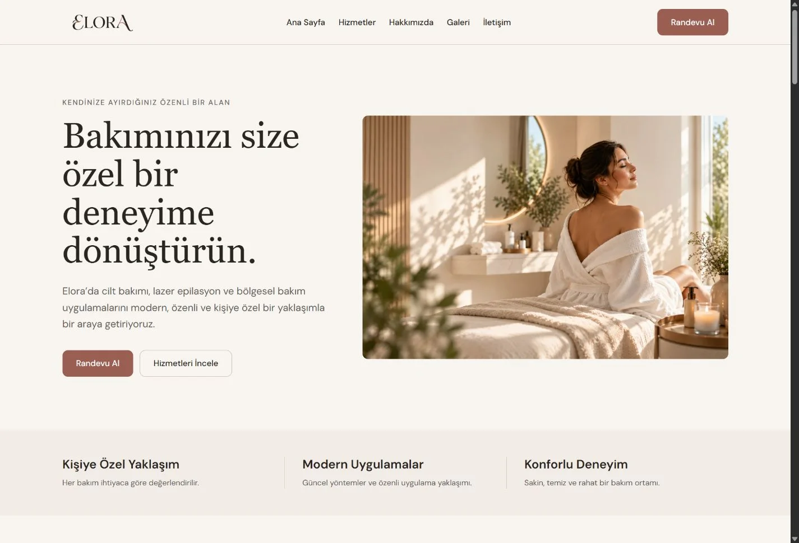
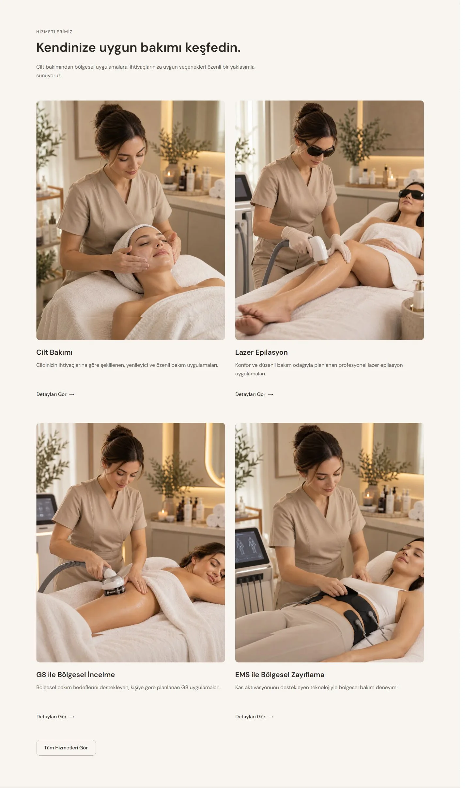
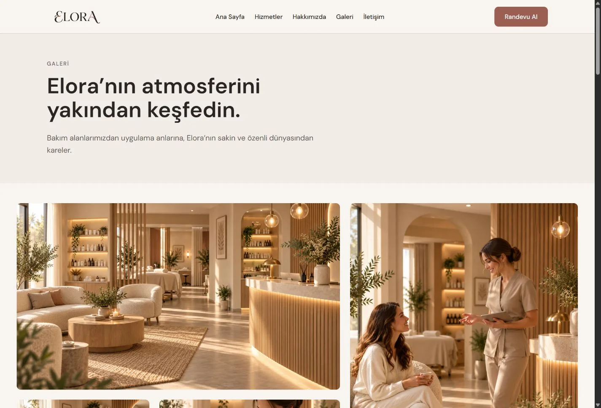
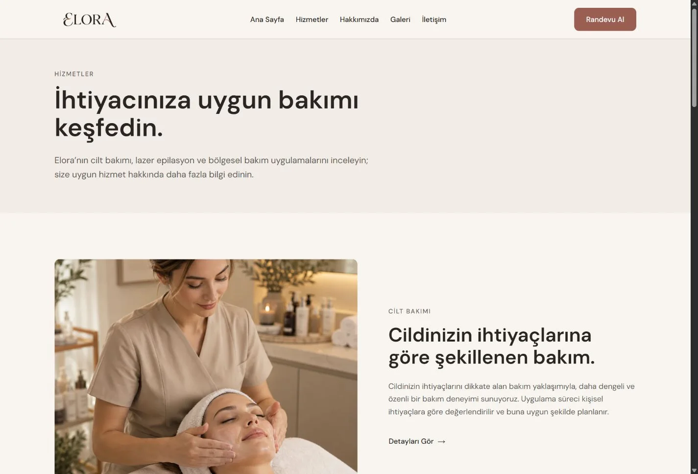
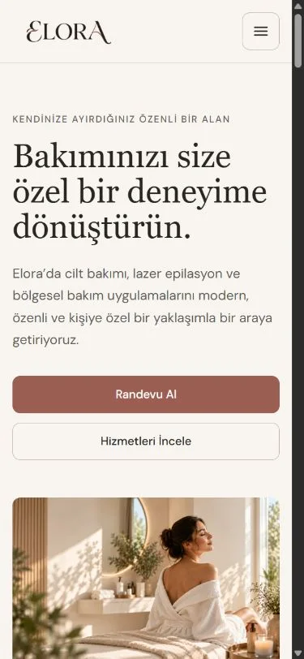
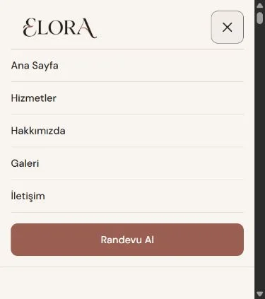
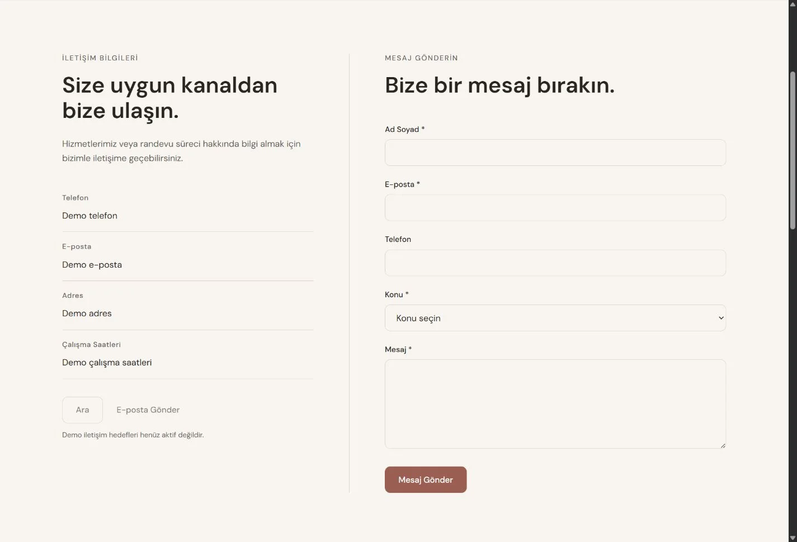
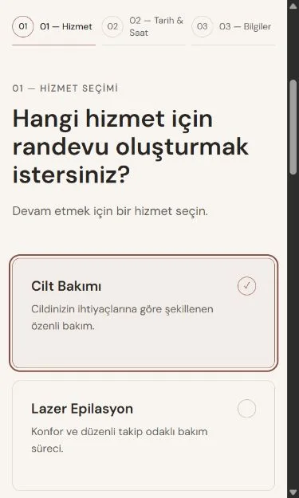
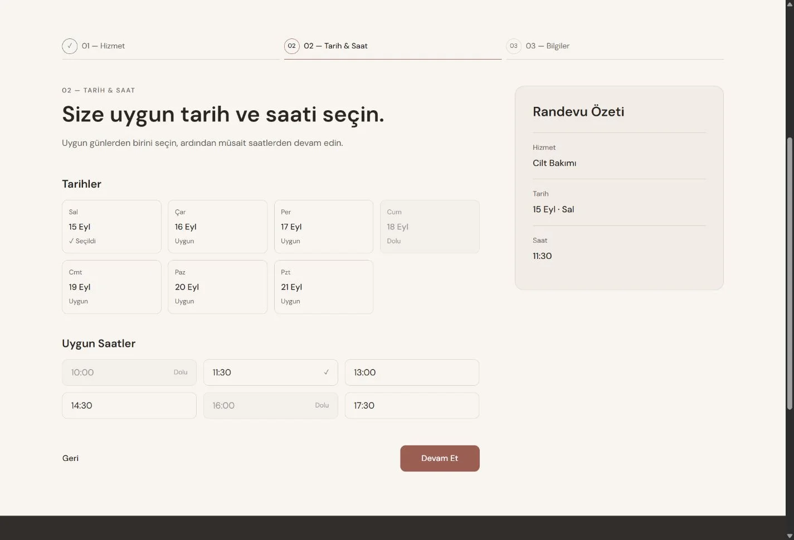

# ELORA — Case Study

## Proje Özeti

ELORA, kurgusal bir güzellik merkezi konsepti için geliştirilen çok sayfalı, responsive bir frontend demosudur. Tasarım sistemi, erişilebilir etkileşimler, yerel görsel optimizasyonu ve static deployment bir arada çalışır. [Canlı demo önizlemesi](https://elora-akd.pages.dev) public olarak erişilebilir; `INDEX_SITE=false` ile arama motoru indexlemesi amaçlanmaz.

*Ana sayfa, masaüstü hero görünümü (1440 px). [Tüm ekran görüntüleri ve kadrajlar](SCREENSHOT_PLAN.md).*

## Amaç

Amaç, bir güzellik merkezi temasını eğitim ve portföy bağlamında tutarlı bir arayüzle sunmak; sayfalar arasında ortak dil, kontrollü component mimarisi ve mobil kullanım kalitesi oluşturmaktı. Proje gerçek işletme operasyonlarını karşılamaya yönelik değildir.

## Kısıtlar

Gerçek işletme, müşteri, randevu kapasitesi veya backend yoktur. Bu nedenle iletişim ve randevu etkileşimleri frontend demo state olarak tasarlandı. Next.js static export, deploy sırasında server runtime, API route ve gerçek rezervasyon işlemlerinin kullanılmaması anlamına gelir. Kurgusal hizmet ve iletişim içerikleri gerçek veri iddiasıyla sunulamaz.

## Tasarım Yaklaşımı

Ana sayfa ilk izlenimden hizmet keşfine, marka atmosferinden iletişim ve randevu yönlendirmesine ilerleyen editorial bir ritim kurar. Hizmetler bilgi ve karşılaştırma, detay sayfaları tek hizmet hakkında açıklama, Galeri ise mekân ve bakım atmosferi için ayrılmıştır. Yoğun lüks efektleri, sahte sosyal kanıt ve sonuç karşılaştırmaları yerine sakin görsel hiyerarşi tercih edildi.

*Ana sayfada hizmet keşfi ve bölüm ritmi.*

*Galeri, mekân ve bakım atmosferini ayrı bir editorial düzende sunar.*

## Design System

Warm Taupe yüzeyler, Warm Terracotta/rosewood vurgular ve `#9B5E52` primary renk ortak token'larda tanımlıdır. DM Sans body/UI ve Georgia editorial başlıklar için kullanılır. Responsive container ile spacing ölçeği sayfalar arası tutarlılık sağlar. Ana radius 10 px, CTA/form kontrol hedefi 48 px; gölge ve gradyanlar ölçülüdür. Header 1024 px'te masaüstü navigasyona geçer.

## Bilgi Mimarisi

Toplam 10 içerik route'u vardır: `/`, `/hizmetler`, dört `/hizmetler/[slug]` detay sayfası, `/hakkimizda`, `/galeri`, `/iletisim` ve `/randevu`. Dört hizmetin slug, kart ve detay içeriği `src/data/services.ts` kaynağından gelir; `generateStaticParams` static export için detay route'larını üretir. Galeri, site ve mock randevu verileri ayrı `src/data/` dosyalarında tutulur.

*Dört demo hizmetinin liste görünümü; hizmet içerikleri ortak veri kaynağından gelir.*

## Component Architecture

Root layout ortak Header ve Footer'ı taşır. Section ve UI bileşenleri sayfalarda yeniden kullanılır; görsel bölümler kendi CSS Modules dosyalarıyla sınırlanır. Server Components varsayılan yaklaşım olarak korunur. Etkileşim sınırları MobileNav, ServiceFaq, ContactForm ve AppointmentFlow içindedir; global store veya UI component kütüphanesi kullanılmaz. Randevu akışındaki state sahibi AppointmentFlow'dur.

## Responsive Strategy

Mobile-first token sistemi 480 / 768 / 1024 / 1280 px kırılımlarını kullanır. Mobilde bölüm sırası ve görsel akış doğal dikey düzene çevrilir; desktop'ın yalnız küçültülmüş bir kopyası olarak ele alınmaz. Desktop hover stilleri fine pointer koşuluna bağlanır. Menü, kartlar, galeri ve üç adımlı form dar ekranlarda ayrı düzenlerle çalışır.

*Yaklaşık 390 px mobil kadrajda metin ve CTA'lar görselden önce gelir.*

  

*Mobil menüde sayfa geçişleri ve demo randevu CTA'sı birlikte görünür.*

## Accessibility

WCAG 2.2 AA seviyesini temel alan uygulama hedefi vardır; bu ölçülmüş uygunluk sertifikası değildir. Ortak `focus-visible`, reduced-motion desteği ve semantik HTML kullanılır. Hizmet FAQ'sunda gerçek button, `aria-expanded` ve kontrollü panel; formda label ve ilişkili hata metinleri; randevuda radio hizmet seçimi ile `aria-pressed`/disabled tarih-saat button'ları bulunur. Klavye kullanımının ve farklı viewport'ların manuel QA ile değerlendirilmesi hedefin parçasıdır.

## Demo Contact Form

İletişim formunda ad, e-posta, konu ve mesaj zorunludur; telefon opsiyoneldir. Native doğrulama ve sınırlı React state alan bazlı hataları gösterir. Başarı görünümü yalnız local frontend durumudur: `fetch`, network submit veya backend işlemi yoktur ve mesaj hiçbir yere gönderilmez. Sitedeki başarı metni gerçek teslimat teyidi olarak yorumlanmamalıdır.

*İletişim alanı bir frontend demo formudur; mesaj teslimi yapılmaz.*

## Demo Appointment Flow

Akış 01 Hizmet, 02 Tarih/Saat ve 03 İletişim Bilgileri adımlarından oluşur. Geçerli `/randevu?hizmet=<slug>` parametresi hizmeti client tarafında ön seçer. Tarih ve saatler `src/data/appointment.ts` içinde üretilen mock uygunluk verisidir. Ad ve telefon gerekli, e-posta ve not opsiyoneldir; son görünüm seçilen hizmet/tarih/saati özetler. Gerçek rezervasyon, ödeme, SMS veya e-posta yoktur; onay ekranı demo state'tir.

*Mobil hizmet seçimi; tarih/saatler ve onay gerçek rezervasyon değil, demo akışıdır.*

*Masaüstü tarih/saat adımı ve randevu özeti; uygunluk verileri mock'tur.*

## Image Optimization

32 içerik PNG'si WebP'ye dönüştürülürken logo PNG olarak korundu. Git'teki `public/images` ve `public/logo` raster blob boyutları birlikte hesaplandığında toplam **63,21 MiB'den 4,71 MiB'ye**, yaklaşık **%92,5** düştü. Bu ölçüm dosya payload karşılaştırmasıdır; yükleme süresi, Core Web Vitals veya Lighthouse sonucu değildir. Static export nedeniyle `next/image` için `unoptimized: true` kullanılır ve görseller yerel dosyalardan sunulur.

## SEO / Static Deployment

Next.js Metadata API title template, sayfa açıklamaları, canonical altyapısı, Open Graph görseli, favicon ve Apple icon sağlar. `sitemap.ts` ve `robots.ts` bulunur. `SITE_URL` mutlak URL'lerin build-time tabanıdır; `INDEX_SITE` yalnız `"true"` ise indexlemeyi açar. Public demo `INDEX_SITE=false` ile preview olarak tasarlanmıştır. Build komutu `npm run build`, static export klasörü `out/`; Cloudflare Pages bu çıktıyı yayımlar. Demo işletme bilgileri için LocalBusiness structured data kullanılmaz.

## QA Süreci

Projede karar belgeleri section, CTA, responsive ve teknik sınırları sabitledi. Teknik QA kapsamı TypeScript, ESLint, production build, responsive ve browser incelemeleri ile accessibility/performance değerlendirmelerini içerir. Erişilebilirlik veya Lighthouse için bu metinde sayısal başarı iddiası verilmez; görsel optimizasyon rakamı Git blob boyutlarından doğrulanmıştır. Deploy sonrasında DNS/network sorunu yaşanırsa uygulama ve ağ katmanları ayrı teşhis edilmelidir; bu belge doğrulanmamış bir olay sonucu iddia etmez.

## Teknik Kararlar

Next.js `16.3.4`, React `19.3.0`, TypeScript `6.0.3`, App Router, CSS Modules ve CSS custom properties kullanılır. Static export, Cloudflare Pages üzerinde basit deploy sağlar. Client state yalnız etkileşim alanlarında tutulur; Tailwind, global state kütüphanesi, backend/API runtime, ücretli image CDN ve gerçek rezervasyon entegrasyonu yoktur.

## Öğrenilenler

- Kilitli karar belgeleri, yeni sayfalarda scope ve tasarım tutarlılığını korumaya yardımcı oldu.
- Hizmet ve galeri verisini yeniden kullanılabilir kaynaklarda tutmak liste, detay ve randevu ön seçimini uyumlu kıldı.
- Server/Client sınırını etkileşimin başladığı yerde çizmek gereksiz browser state yayılımını sınırladı.
- Responsive ve klavye QA'sını yalnız teslim sonuna bırakmamak component kararlarını etkiledi.
- İçerik görsel formatı, ölçülebilir raster payload üzerinde büyük fark yarattı.
- Static export kısıtları, formların ve randevunun gerçek işlem gibi anlatılmamasını gerektirdi.
- Deploy sonrası erişim sorunlarında DNS/network ile uygulama/build nedenlerini ayrı değerlendirmek gerekir.

## Canlı Demo

[ELORA public demo önizlemesi](https://elora-akd.pages.dev). `INDEX_SITE=false` bu demoyu arama motorlarına açmayı amaçlamayan build-time seçimidir.

## Demo Disclaimer

ELORA gerçek bir güzellik merkezi değildir. İşletme ve iletişim bilgileri, çalışma saatleri, hizmet anlatımı ve randevu uygunluk verileri kurgusal/demo amaçlıdır. Gerçek müşteri veya ticari hizmet temsil edilmez. Formlar gerçek veri göndermemektedir; iletişim mesajı iletilmez ve randevu kaydı oluşturulmaz.
